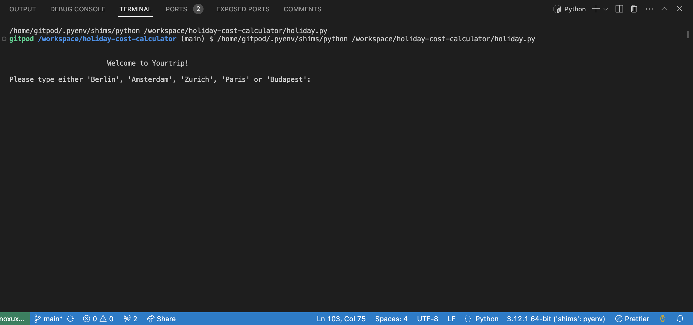
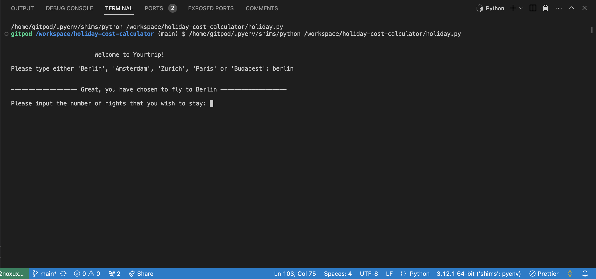
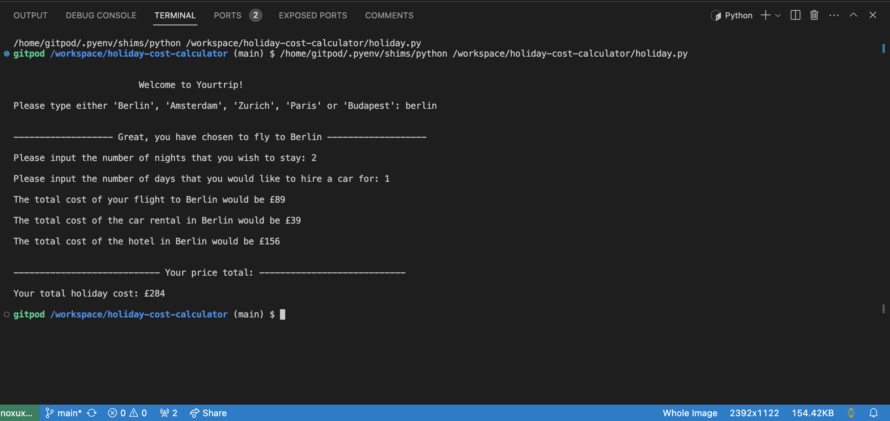

# holiday-cost-calculator

A holiday cost calculator program which is to be run in a code editor terminal, developed on VScode using Python.

## Description
A program which offers a quote for various holiday destinations, factoring in the cost of flight, hotel and car rental.

## Languages used

- Python

# Goals

## My Goals as a developer
* To provide a simple to navigate program, ensuring that information is clear and consise.
* To provide an accurate quote to the user based on their requirements.
* To provide a seemless process, handling any possible errors that may occur.
* To provide 5 holiday destination options.
* To use best coding practices, intending to use simple and easy to read code with minimal repetition.

## User Goal
* To be presented with clear, accurate and concise information.
* To have any possible errors handled without the program breaking.
* To receive an accurate and easy to read quote at the end of the program.

# Installation

### It is recommended to download a code editor such as VScode if you don't have one, although you can view this project in a browser.

* Go to https://github.com/cfff226/holiday-cost-calculator
* Select the repository.
* Navigate to the green button labeled 'Code'.
* Select 'Download ZIP'.
* Open up your code editor.
* Select 'File' and navigate to 'Open Folder' from the tab at the top of your screen.
* Select the downloaded folder from the pop up window.
* Open the downloaded folder, this will open all files from the zip folder in the code editor.

# Usage
* Select the triangular play button in the top right corner of the code editor to start the program

* Enter the holiday destination of your choice

* Enter the number of nights you wish to stay in a hotel

* Enter the number of days you wish to rent a car for

# Credits
This project is based on Task 16 of the Software Engineering course at Hyperiondev.